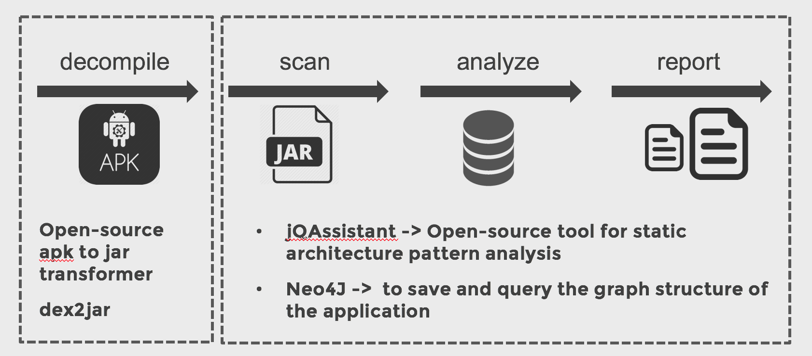
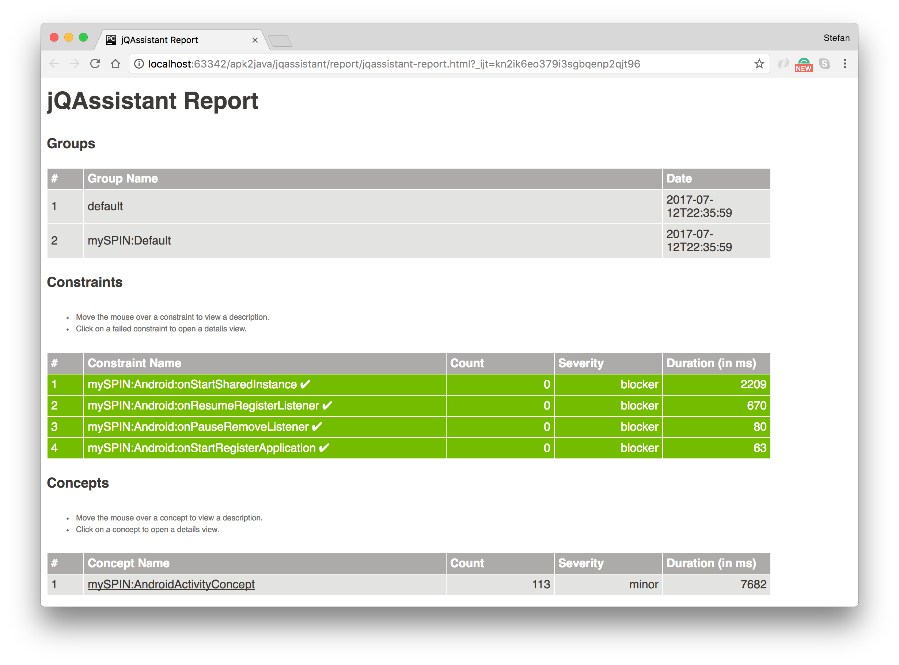
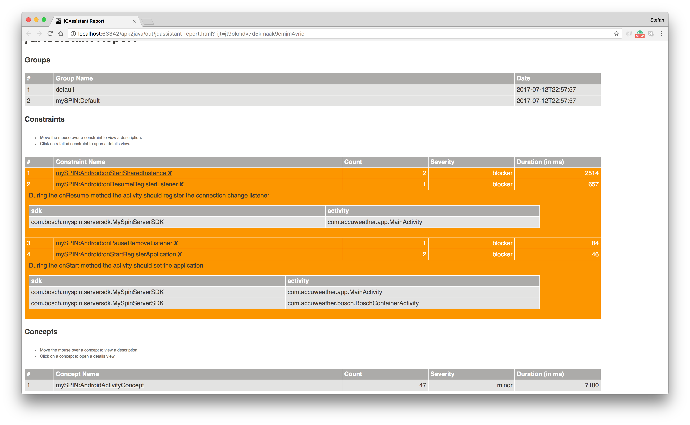

# Android reverse engineer jQAssistant 

This is a simple prototype to run jQAssistant tests on a apk file. 


## Introduction
This script decompiles an apk to its corresponding java jar file and scan this file with jQAssistant. 

 ***This script just automates the sequence in which various tools are initiated and does not handle any error events. You will have to go through the cmd verbose to figure out the problem.***

## Getting started

### Requirements

* JRE 1.7 (Java Runtime Environment)
* Python 3


### Actions


**Test**

Decompile the apk, analyze the jar, check the [rules](./rules)  and creates an report.

```sh 

$ python apk_to_jqassistant.py test yourFile.apk

```

**Server**

Just starts the neo4J server instance 

```sh 

$ python apk_to_jqassistant.py server

```

**Analyze**

Only check the [rules](./rules) and creates the report 

```sh 

$ python apk_to_jqassistant.py analyze

```


## Architecture 



## Example output 

This is just a simple example output of a apk that I downloaded form the google play store. 

### Success


### Failed


## Tools used

* [Dex2jar](http://code.google.com/p/dex2jar/)
* [jQAssistant](https://jqassistant.org/)

